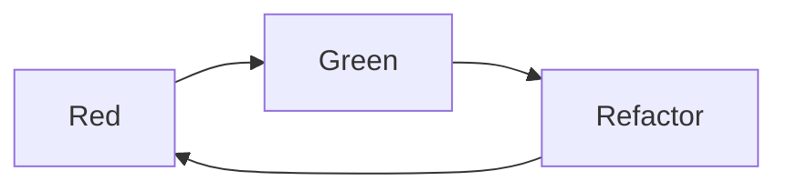

# Testing Ruby with RSpec: The Complete Guide

- <https://www.udemy.com/course/testing-ruby-with-rspec>

## Types of Tests

Three layers of tests:

- **Unit tests**: focus on individual units (a class, module, object or method)
- **Integration tests**: 
- **E2E tests**: focus on a feature and its interaction with the entire system.
    - specs hard to write, hard to troubleshoot and run slow.

We should have more unit tests, then integration tests, and then end-to-end tests.

![[RSpec - udemy - types of tests.png]]

I also like what Kent Dods says in <https://testingjavascript.com>:

![[RSpec - udemy - testing trophy.png]]

## Install RSpec and Start a Project

Install globally:
```bash
gem install rspec
```

Start a new project
```bash
mkdir rspec-course
cd  rspec-course
rspec --init
```

The "init" will create `.rspec` and `spec/spec_helper.rb`


## Test-Driven Development TDD

- Write your tests first, and the tests drive your development.

It's a top-down approach, where you first think about how you wanna use a piece of software, and then write the software.

Red -> Green -> Refactor



> What are the benefits of TDD?
> 
> Number one, it forces you to become a better developer. Simply practicing this thing is one of the best ways that I have become a better developer and matured as a programmer, especially in my object oriented thinking.
> You don't have to read additional blog posts. You don't have to read additional blog posts. This is something that you can do every day. Whenever you write code, just write your tests first.


## The `describe` method

The `describe` method creates an **example group**.

```ruby
RSpec.describe 'Card' do

end
```

- RSpec is a  module
- on that module we have the `describe` method
- we give two arguments to the `describe` method:
    - the `'Card'` string
    - a `do-end` block
- inside the `do-end` block is where we will write all of our tests for the `Card`.

A test is also known as an "example". And "example group" is a set of related tests.


## The `it` method

The `describe` creates an **example group**, the `it` method creates an **example**.

