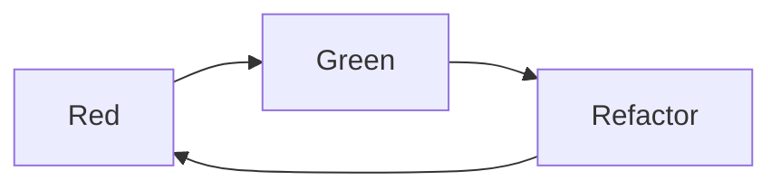

# Testing Ruby with RSpec: The Complete Guide

- <https://www.udemy.com/course/testing-ruby-with-rspec>

[TOC]

## Section 1: Introduction


### Types of Tests

Three layers of tests:

- **Unit tests**: focus on individual units (a class, module, object or method)
- **Integration tests**: 
- **E2E tests**: focus on a feature and its interaction with the entire system.
    - specs hard to write, hard to troubleshoot and run slow.

We should have more unit tests, then integration tests, and then end-to-end tests.

![[RSpec - udemy - types of tests.png]]

I also like what Kent Dods says in <https://testingjavascript.com>:

![[RSpec - udemy - testing trophy.png]]

### Install RSpec and Start a Project

Install globally:
```bash
gem install rspec
```

Start a new project
```bash
mkdir rspec-course
cd  rspec-course
rspec --init
```

The "init" will create `.rspec` and `spec/spec_helper.rb`


### Test-Driven Development TDD

- Write your tests first, and the tests drive your development.

It's a top-down approach, where you first think about how you wanna use a piece of software, and then write the software.

Red -> Green -> Refactor



> What are the benefits of TDD?
> 
> Number one, it forces you to become a better developer. Simply practicing this thing is one of the best ways that I have become a better developer and matured as a programmer, especially in my object oriented thinking.
> You don't have to read additional blog posts. You don't have to read additional blog posts. This is something that you can do every day. Whenever you write code, just write your tests first.


### The `describe` method - example group

- [doc](https://relishapp.com/rspec/rspec-core/v/3-8/docs/example-groups/basic-structure-describe-it)

The `describe` method creates an **example group**.

```ruby
RSpec.describe 'Card' do

end
```

- RSpec is a  module
- on that module we have the `describe` method
- we give two arguments to the `describe` method:
    - the `'Card'` string
    - a `do-end` block
- inside the `do-end` block is where we will write all of our tests for the `Card`.

A test is also known as an "example". And "example group" is a set of related tests.


### The `it` method - a single example

- [doc](https://relishapp.com/rspec/rspec-core/v/3-8/docs/example-groups/basic-structure-describe-it)

The `describe` creates an **example group**, the `it` method creates a single **example**.

```ruby
RSpec.describe 'Card' do
  it 'has a type' do
    
  end
end
```

The idea is to describe how the software should behave, instead of saying it should be implemented.

**Note**: the `specify` method has the exact same meaning as `it`.


### The `expect` method

- [doc](https://www.rubydoc.info/gems/rspec-expectations/RSpec/Matchers#expect-instance_method)

Doing assertions with `expect`.

```ruby
RSpec.describe 'Card' do
  it 'has a type' do
    card = Card.new('Ace of Spades')
    expect(card.type).to eq('Ace of Spades')
  end
end
```

### Assignment 1

Create an example group with a string argument of "math calculations".

Inside the group, create an example with a string argument of "does basic math".

Inside the example, write 4 mathematical assertions of your choice.

The **expect** method should receive a valid mathematical expression (for example, 3 + 4 or 5 * 3).

The **eq** method should compare the result fo the evaluation with the right answer.

```ruby
RSpec.describe 'math calculations' do
  it 'does basic math' do
    expect(MyMath.plus(3, 4)).to eq(7)
    expect(MyMath.minus(3, 4)).to eq(-1)
    expect(MyMath.multiply(3, 4)).to eq(12)
    expect(MyMath.divide(8, 4)).to eq(2)
  end
end
```


### Running the tests and reading failures

```bash
# run all tests in the spec/
rspec

# run a specific test file (aka example group)
rspec spec/card_spec.rb

# run a specific test (aka example)
rspec spec/card_spec.rb:2
```

### Exercise

Create a class based on this test suite (example group):
```ruby
RSpec.describe School do
  it 'has a name' do
    school = School.new('Beverly Hills High School')
    expect(school.name).to eq('Beverly Hills High School')
  end

  it 'should start off with no students' do
    school = School.new('Notre Dame High School')
    expect(school.students).to eq([])
  end
end
```

### Reducing duplication - Before hook and instance variables

- [docs](https://relishapp.com/rspec/rspec-core/v/3-12/docs/hooks/before-and-after-hooks)

Consider this example group, with two tests, both of them instantiating a `Card`:

```ruby
RSpec.describe Card do
  it 'has a rank' do
    card = Card.new('Ace', 'Spades')
    expect(card.rank).to eq('Ace')
  end

  it 'has a suit' do
    card = Card.new('Ace', 'Spades')
    expect(card.suit).to eq('Spades')
  end
end
```

In order to prevent duplication we're going to use an instance variable and assign a value to it in a `before` method:

```ruby
RSpec.describe Card do
  before do
    @card = Card.new('Ace', 'Spades')
  end

  it 'has a rank' do
    expect(@card.rank).to eq('Ace')
  end

  it 'has a suit' do
    expect(@card.suit).to eq('Spades')
  end
end
```


### Reducing duplication - Helper methods

Another way to reduce duplication is to use a helper method. In this example, such method is called `card`:
```ruby
RSpec.describe Card do
  def card
    Card.new('Ace', 'Spades')
  end

  it 'has a rank' do
    expect(card.rank).to eq('Ace')
  end

  it 'has a suit' do
    expect(card.suit).to eq('Spades')
  end
end
```
Although it seems interesting, it can bring problems. Like the one explained below:
```ruby
class Card
  # rank can be changed
  attr_accessor :rank, :suit

  def initialize(rank, suit)
    @rank = rank
    @suit = suit
  end
end

RSpec.describe Card do
  def card
    Card.new('Ace', 'Spades')
  end

  it 'has a rank and that rank can change' do
    expect(card.rank).to eq('Ace')
    card.rank = 'Queen' # this is actually create a new Card
    expect(card.rank).to eq('Queen') # again, creating a new Card
  end
end
```

Every time a `card` is used, it gives an impression that it's an object but it's actually a method, creating new `Card` objects everytime it's called.


### Reducing duplication - the `let` method

- [doc](https://relishapp.com/rspec/rspec-core/v/3-12/docs/helper-methods/let-and-let)

Uses memoization to create an object.

```ruby
let(:card) { Card.new('Ace', 'Spades') }
```

It uses lazy loading, therefore better than using `before`. Why? Because `before` runs before every single test, while using `let` makes that block to run only when the symbol passed to `let` is called.


### The `context` method and nested `describe`s

- `describe` can be nested
- `context` is a synonym for `describe`

Example:
```ruby
RSpec.describe '#even? method' do
  context 'with even number' do
    it 'should return true' do
      expect(4.even?).to eq(true)
    end
  end

  context 'with odd number' do
    it 'should return false' do
      expect(5.even?).to eq(false)
    end
  end
end
```