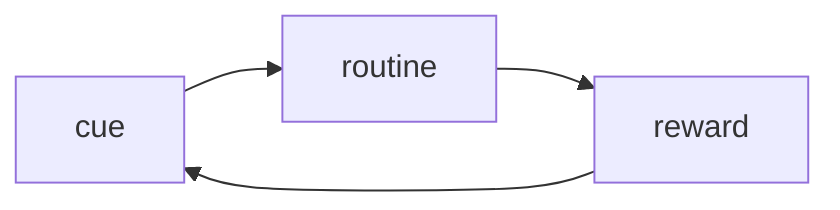
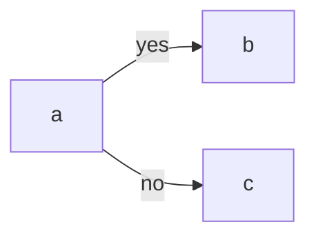
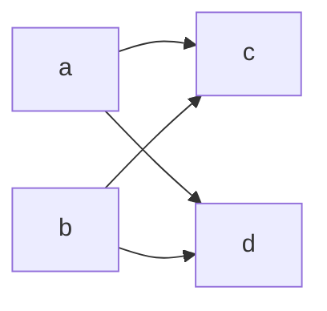
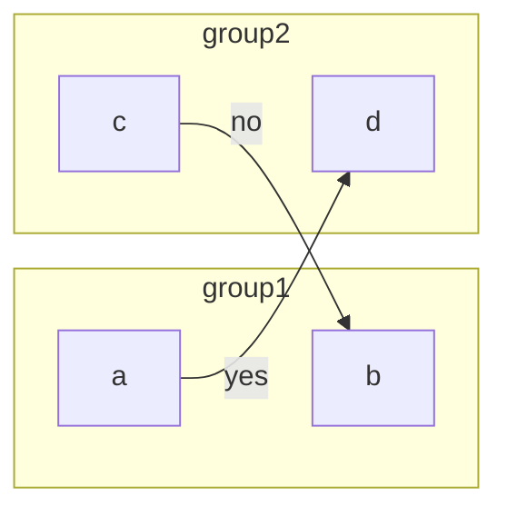
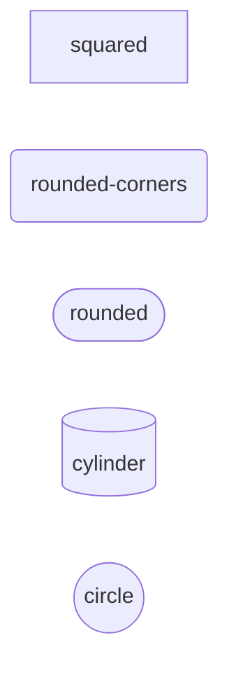
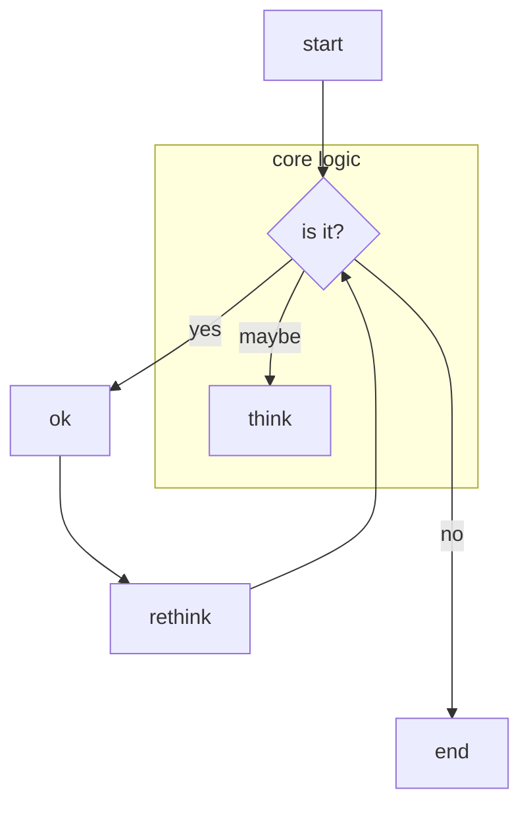
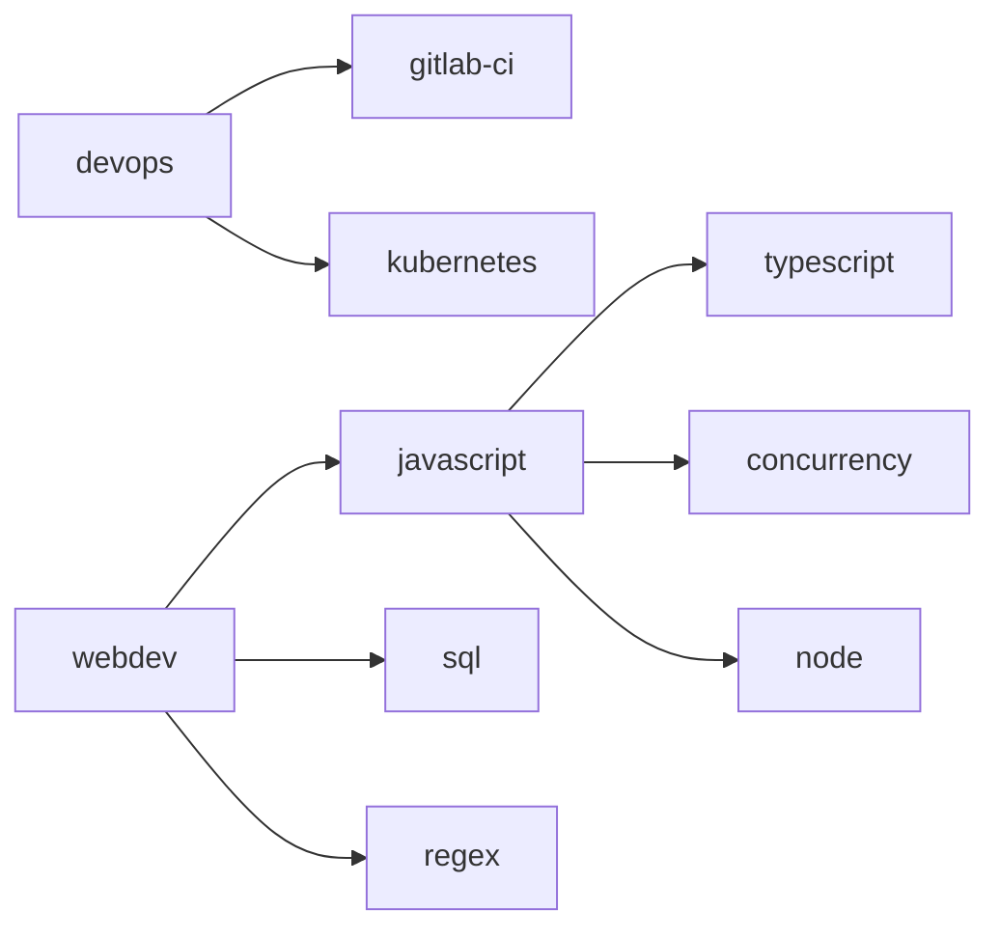
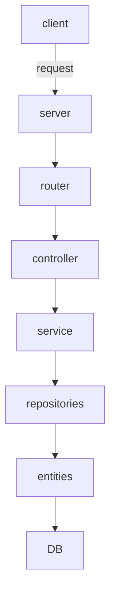

# mermaid

- live editor: <https://mermaid-js.github.io/mermaid-live-editor>
- video showing mermaid feature on Obsidian: <https://youtu.be/rxJZ7oG0UOQ>

## simple graph

In `graph` line, `TB` means "top to bottom", `LR` means "left to right". Similarly you can use `BT` and `RL`.

### links with text

### shorter syntax for multiple connections

## subgraphs

## node shapes

Just the basic ones

## elaborated example

## my goals

## ExpressJS backend - RocketSeat style

