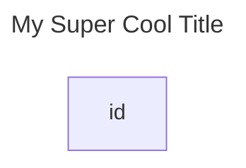

# mermaid - add title to a diagram

To add a title to a #mermaid diagram you just need to add a "yaml frontmatter" with a `title` property, like this:

```
---
title: My Super Cool Title
---
flowchart LR
    id
```



## references

- <https://mermaid.js.org/syntax/stateDiagram.html>